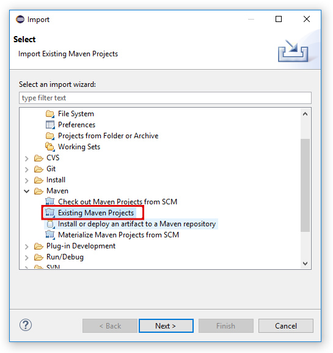
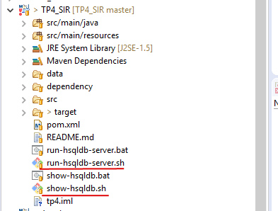

<h1>TP 4</h1>
#Le TP a pour objectif de manipuler les données avec JPA et un système de base de données HSQL

<h2>Prerequis pour ce projet </h2>
<ul>
  <li>Avoir une base en programmation Java</li>
  <li>Avoir une base en SQL </li>
  <li>Avoir une base dans les base de données relationnelles</li>
  <li>Un base dans la gestion de dependance avec Maven serait un plus
</ul>

<h2>Technologies utilisées</h2>
<ul>
  <li>JPA</li>
  <li>Pattern DAO</li>
  <li>JAX-RS</li>
</ul>

<h2>Description de l'API</h2>

<ol>
  <li>Acceder au service opower</li>
  http://localhost:8080/opower

  <li>Avoir la liste des personnes</li>
  http://localhost:8080/opower/persons

  <li>Avoir la liste des homes</li>
  http://localhost:8080/opower/homes

</ol>

<h2>Deploiement</h2>
<ol>
  <li>Cloner le projet avec le lien de github</li>
  <li>S'assurer que Maven est installé sur notre machine</li>
  <li>Impoter le projet cloné en cliquant sur File > Import > Maven > Existing maven project</li>
  
  <li>Explorer le dossier du projet, lancer le serveur de base de données HSQLDB</li>
  
   
  <h2>ou</h2>
  <li>Lancer le serveur MySQL</li>
  <li>Créer une base de données du nom de "testjpa"</li>

  <li>Lancer votre application Maven en cliquant sur Run > Run as > Maven Build > </li>

</ol>

<h2>Auteurs</h2>
  <li>SARR Seynabou</li>
  <li>BOUE Melaine</li>
</ul>
